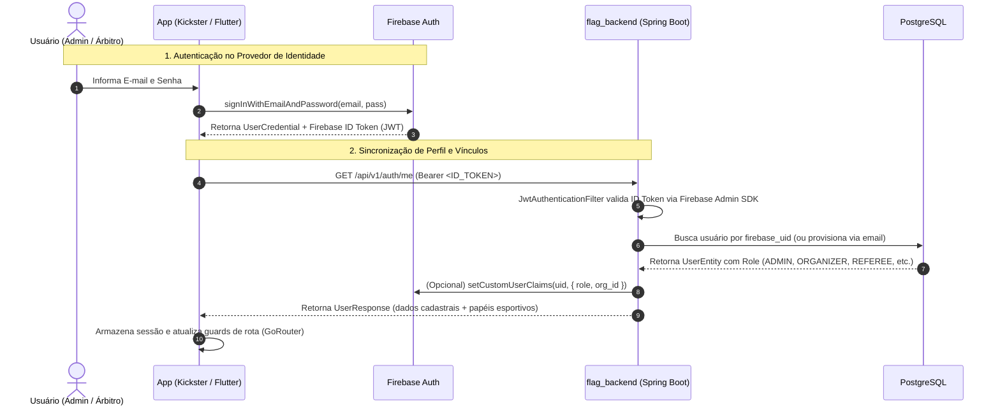
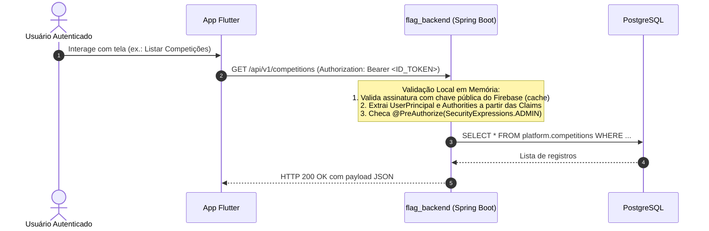
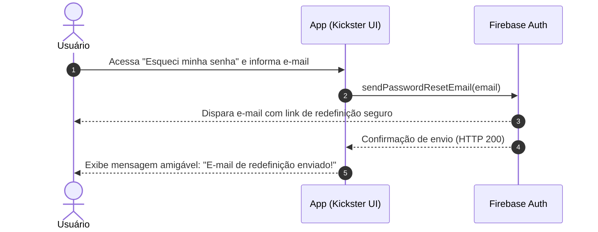

# ADR-010 — Autenticação Firebase-First com Custom Claims e Validação Stateless

## Status

**Aceito** — 2026-09-07 (Substitui e consolida a proposta anterior que colidia com a ADR-004 de API First)

---

## 1. Contexto

A Flag Platform é composta por múltiplos clientes:
- **`flag_admin_web`**: Painel administrativo web para gestores de federações, ligas e agremiações.
- **`flag_referee_app`**: Aplicativo móvel/tablet para árbitros e mesários operando à beira do campo.
- **`flag_public_app`**: Aplicativo móvel para torcedores, atletas e comunidade esportiva.

Anteriormente, a plataforma contava com autenticação fragmentada baseada em JWT custom (HS256) emitido diretamente pelo Spring Boot (`flag_backend`). Esse modelo gerava graves problemas:
1. O backend acumulava responsabilidades que não são do seu domínio central (armazenamento e hash de senhas, validação de formato, infraestrutura de e-mails para recuperação de senha).
2. Ausência de suporte nativo a OAuth (Google, Apple) e MFA.
3. Risco de indisponibilidade ou latência caso cada requisição de API exigisse consultas síncronas de autorização entre microsserviços.
4. Chamadas desatualizadas nos clientes (o `flag_referee_app` apontava para endpoints legados como `/api/v1/auth/login`).

Além disso, na documentação histórica houve uma colisão de numeração entre a **ADR-004 — API First** e uma proposta anterior de migração. Esta ADR-010 resolve a colisão e oficializa a decisão arquitetural definitiva.

---

## 2. Decisão Arquitetural

Adotamos o padrão **Firebase-First com Custom Claims e Validação Stateless no Backend**:

1. **Firebase Auth como Provedor de Identidade (IdP)**:
   - Todos os aplicativos clientes (Web e Mobile) realizam cadastro (`createUserWithEmailAndPassword`), login (`signInWithEmailAndPassword`), redefinição de senha (`sendPasswordResetEmail`) e autenticação social diretamente pelo Firebase Auth SDK.
   - O backend não armazena senhas em texto plano, nem hashes bcrypt, e não possui servidor SMTP para recuperação de senhas.

2. **PostgreSQL (`flag_backend`) como Fonte Única da Verdade para Regras e Papéis**:
   - A tabela `users` no PostgreSQL mantém a autoridade sobre papéis esportivos (`role`), status de aprovação (`status`) e afiliações organizacionais (`organization_id`, `club_id`).

3. **Sincronização Bidirecional via Custom Claims**:
   - O backend utiliza o **Firebase Admin SDK** para gravar as roles e IDs de afiliação diretamente nos **Custom Claims** do Firebase:
     ```json
     {
       "sub": "firebase-uid-12345",
       "role": "ADMIN_LIGA",
       "organization_id": "9b1deb4d-3b7d-4bad-9bdd-2b0d7b3dcb6d",
       "club_id": null,
       "email": "gestor@flagplatform.com.br"
     }
     ```

4. **Validação 100% Stateless nas Requisições de Negócio**:
   - Quando o cliente realiza chamadas às APIs de negócio (ex.: `/api/v1/competitions`, `/api/v1/games`), o `flag_backend` valida a assinatura criptográfica do ID Token utilizando as chaves públicas do Google (em cache local).
   - O backend extrai a role diretamente das Claims do token em memória, **sem realizar nenhuma chamada de rede externa ou consulta repetitiva de autorização**, garantindo latência mínima e alta performance.

5. **Extensão Obrigatória da ADR-001 para Todos os Clientes**:
   - Tanto o **`flag_admin_web`** quanto o **`flag_referee_app`** devem adotar a arquitetura oficial Flutter (ADR-001):
     - Camada Domain: entidades e regras de validação.
     - Camada Data: `AuthService` e `AuthRepository`.
     - Camada Presentation: ViewModels dedicados (1:1 com as Views via Riverpod/ChangeNotifier) e Widgets do design kit Kickster.
   - O `flag_referee_app` implementa **modo offline resiliente** com `flutter_secure_storage`, garantindo que o árbitro continue logado durante a partida mesmo sob oscilação ou ausência de sinal 4G.

6. **Design System Kickster**:
   - A experiência do usuário de todos os formulários e telas de autenticação segue o design kit oficial **"Kickster - Live Score & News Sport Apps UI Kits (Community)"** (`design/figma-reference/kickster_auth.json`).

---

## 3. Diagramas de Sequência

### 3.1. Fluxo de Login / Cadastro e Sincronização de Roles



---

### 3.2. Fluxo Stateless de Requisições de Negócio (Zero Latência)



---

### 3.3. Fluxo de Recuperação de Senha (Esqueci a Senha)



---

## 4. Matriz de Papéis e Permissões (RBAC)

| Papel (*Role*) | Escopo de Acesso | Custom Claim (`role`) | Descrição e Permissões |
|---|---|---|---|
| **`ADMIN`** / **`ADMIN_LIGA`** | Global da Plataforma / Liga | `"ADMIN"` / `"ADMIN_LIGA"` | Acesso irrestrito a configurações, criação de usuários, aprovação de contas e gestão de torneios. |
| **`ORGANIZER`** | Organização Federativa | `"ORGANIZER"` (`organization_id`) | Gestão de campeonatos, agremiações filiadas, tabelas e locais de jogo de sua entidade. |
| **`MANAGER`** | Agremiação / Clube | `"MANAGER"` (`club_id`) | Gestão de elencos (*rosters*), inscrição de times e acompanhamento de atletas. |
| **`REFEREE`** | Súmula e Arbitragem | `"REFEREE"` | Acesso ao `flag_referee_app` para check-in de atletas, controle de cronômetro e envio de súmulas. |
| **`COACH`** | Comissão Técnica | `"COACH"` (`club_id`) | Visualização tática e submissão de escalações para partidas. |
| **`ATHLETE`** | Individual do Atleta | `"ATHLETE"` | Perfil pessoal no `flag_public_app`, visualização de estatísticas e consentimentos. |

---

## 5. Consequências

### Positivas
- **Segurança de Nível Enterprise**: Senhas e identidades delegadas à infraestrutura segura do Google Firebase.
- **Zero Overhead no Backend**: Validação puramente em memória das requisições com chave pública, eliminando chamadas de rede entre microsserviços para autorização.
- **Arquitetura Unificada**: Frontend Web e Mobile operam sob os mesmos contratos e sob o padrão oficial ADR-001.
- **Operação de Campo Confiável**: Árbitros operam offline no `flag_referee_app` sem interrupções por timeout de sessão.

### Negativas / Mitigações
- **Limite de 1000 bytes em Custom Claims**: Mitigado pelo uso de claims compactas (`role`, `organization_id`, `club_id`), deixando detalhes de perfil armazenados no PostgreSQL.
- **Latência de propagação de novas claims**: Mitigado pela emissão forçada de token atualizado (`getIdToken(true)`) quando o usuário tem seu papel alterado.

---

## 6. Documentos Relacionados
- [ADR-001 — Nova Filosofia de Arquitetura de Aplicações](ADR-001-nova-filosofia-arquitetura.md)
- [ADR-003 — Modular Monolith com Spring Boot](ADR-003-modular-monolith.md)
- [ADR-004 — API First](ADR-004-api-first.md)
- [Plano de Migração de Autenticação](plano-migracao-firebase-auth.md)
- [Diretrizes de Trabalho de Agentes e GitFlow](../architecture/diretrizes-trabalho-agentes.md)
