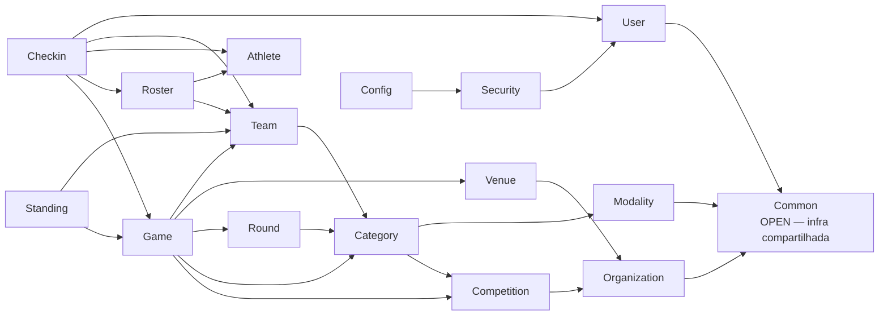
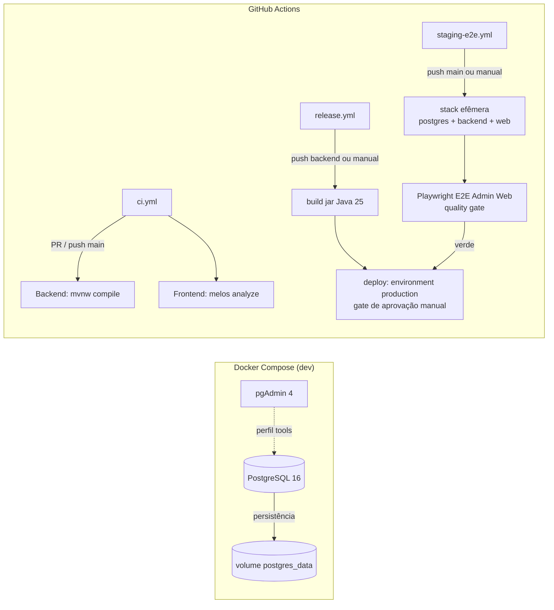

## Flag Platform — Componentes

Catálogo detalhado dos componentes da solução, por camada. Tudo aqui reflete o código-fonte atual (branch `main`).

## Repositório (monorepo)

```
flag-platform/
├── flag_backend/         → API Spring Boot (Modular Monolith) - Core backend
├── flag_admin_web/       → Interface web para gestão administrativa
├── flag_referee_app/     → App Flutter para árbitros/mesa (operação de jogos)
├── flag_public_app/       → App Flutter público (torcedores, atletas)
├── flag_tester_e2e/       → Suite de testes end-to-end (Playwright)
├── flag_platform_docs/    → Documentação, ADRs, design, arquitetura
└── infrastructure/        → Docker Compose (PostgreSQL + pgAdmin)
```

## Aplicações da Plataforma

| App | Tecnologia | Responsabilidade | Público-alvo | Auth |
|-----|------------|-----------------|--------------|------|
| **Flag Backend** | Spring Boot 4.1 / Java 25 | API REST, regras de negócio, persistência | Todos os apps | JWT (migrando para Firebase) |
| **Flag Admin Web** | Flutter Web | Gestão administrativa, cadastros, usuários | Staff, organizadores | JWT / Firebase |
| **Flag Referee App** | Flutter | Operação de jogos, check-in, lances ao vivo | Árbitros, mesa | JWT / Firebase |
| **Flag Public App** | Flutter | Torcedores, atletas, acompanhamento ao vivo | Todos | Firebase Auth (opcional) |
| **Flag Tester e2e** | Playwright | Testes end-to-end em staging/produção | QA, Dev | - |

## Backend (Spring Boot 4.1 / Java 25 / Maven)

### Camadas técnicas (em todo módulo)

```
{module}/
├── {Module}.java        → marcador @ApplicationModule (Spring Modulith)
├── {Lookup}.java        → interface de API pública entre módulos
├── {Info}.java          → record de projeção pública
├── controller/          → REST
├── service/             → regras de negócio
├── repository/          → Spring Data JPA
├── entity/              → entidades JPA
├── mapper/              → MapStruct
├── dto/request|response/→ records validados
└── exception/           → subclasses de ApiException
```

### Módulos de domínio

| Módulo | Responsabilidade | Lookup público |
|--------|------------------|----------------|
| `organization` | Organizações (federações, ligas, clubes) | `OrganizationLookup` |
| `competition` | Campeonatos por organização | `CompetitionLookup` |
| `modality` | Catálogo de modalidades (Flag 5x5/8x8/9x9, Full Pads 11x11) | `ModalityLookup` (`ModalityInfo`) |
| `category` | Categorias por campeonato (combinação modalidade + gênero + faixa etária) | `CategoryLookup` |
| `venue` | Campos de jogo | `VenueLookup` (`VenueInfo`) |
| `team` | Times por categoria | `TeamLookup` (`TeamInfo`) |
| `round` | Rodadas por categoria (REGULAR/PLAYOFFS) | `RoundLookup` (`RoundInfo`) |
| `game` | Jogos, status, placar, eventos de ponto | `GameLookup` + `GameResultRegisteredEvent` |
| `standing` | Classificação calculada | — |
| `athlete` | Atletas | `AthleteLookup` (`AthleteInfo`) |
| `roster` | Inscrição de atletas em times | `RosterLookup` |
| `checkin` | Check-in e validação de atletas por jogo | — |
| `user` | Usuários, papéis, aprovação, senha | `UserLookup` + `TokenProvider` |
| `common` | Infra compartilhada (módulo OPEN) | — |

### Dependências entre módulos

Diagrama de dependências (extraído pelo Spring Modulith via `ArchitectureTest`; versão em PlantUML: [`diagrams/modules.puml`](diagrams/modules.puml)):



Regra de arquitetura: **dependências apenas via interfaces `{Lookup}`** (sem acessar entity/dto/exception de outro módulo), validada por `ApplicationModules.verify()`.

### Infraestrutura (fora do Modulith)

| Pacote | Conteúdo |
|--------|----------|
| `config` | `SecurityConfig`, `CorsConfig`, `FlywayConfig`, `OpenApiConfig` |
| `security` | `JwtTokenProvider`, `JwtAuthenticationFilter`, `LoginRateLimitFilter` |
| `common.converter` | `PersistableEnumConverter` + 13 converters de enum |
| `common.exception` | `ApiException` (RFC-7807 `ProblemDetail`), `GlobalExceptionHandler` |
| `common.pagination` | `PagedResponse<T>` (com header `X-Total-Count`) |
| `common.persistence.entity` | `BaseEntity` (id UUID + timestamps + auditoria) |
| `common.response` | `ApiResponse<T>` (envelope success/message/data) |
| `common.security` | `SecurityExpressions` (SpEL centralizada) |

## Frontend (workspace Flutter com melos)

### Packages compartilhados

| Package | Responsabilidade | Depende de |
|---------|------------------|------------|
| `flag_domain` | Modelos de domínio puros (`fromJson`/`toJson` manuais) + enums | — |
| `flag_core` | Tema Shifty (`AppColors`, `AppTheme`), widgets de estado (`AppLoading`, `AppEmptyState`, `AppErrorState`), `SessionManager` (secure storage), `AppConfig`, `AppStrings` (pt-BR) | `flag_domain` |
| `flag_api` | Cliente `dio` (`ApiClient`), `RepositoryException`, 12 serviços REST | `flag_core`, `flag_domain` |

### Apps

| App | Telas | Navegação | Auth |
|-----|-------|-----------|------|
| `flag_admin_web` | login, signup, forgot/reset password, home (grid de cards), 9 listas + formulários, aprovações, usuários | GoRouter com `context.go` (rotas explícitas) e `context.push` (pilha) | JWT + `AuthController` |
| `flag_referee_app` | login, home, game operation (placar ao vivo), check-in/validação | GoRouter protegido | JWT + `AuthController` |
| `flag_public_app` | home (campeonatos), detalhe da competição, jogos, resultados, classificação, detalhe do jogo | GoRouter público | Sem login |
### Padrões de UI (tema Shifty)

- **Paleta**: primary `#FD6B22`, secondary `#F15223`, success `#4FBF67`, danger `#F04C4C`, background `#FAFAFA`, texto `#1B1D21`/`#737373`.
- **Tipografia**: DM Sans (bundle via Google Fonts pendente; fallback da fonte padrão).
- **Formas**: botões/inputs/cards raio 16, chip 10, checkbox 2; botões min 56px; inputs com rótulo sempre visível.
- Fonte da verdade: [`docs/design/tokens.md`](../design/tokens.md).

## Infraestrutura e CI/CD



| Recurso | Descrição |
|---------|-----------|
| **CI** | Em todo PR: backend `./mvnw compile` e frontend `melos analyze` (sem testes — qualidade via E2E) |
| **Staging E2E** | `staging-e2e.yml` (push em `main` em paths relevantes ou manual): stack efêmera (postgres + backend perfil `staging` + build web Admin Web) + suíte Playwright em `e2e/` (login e criação de organização) como quality gate |
| **Release** | `release.yml` (push em `main` em `backend/**` ou manual): build do jar → job `deploy` com **environment `production`** (aprovação manual) |
| **Docker** | `infrastructure/docker/docker-compose.yml`: PostgreSQL 16 (healthcheck `pg_isready`) + pgAdmin (perfil `tools`) |
| **Swagger** | `/swagger-ui.html` e `/api-docs` (springdoc 3.x) |
| **Métricas** | Actuator + Prometheus em `/actuator/prometheus` e `/actuator/health` |

### Pontos de atenção (gaps conhecidos)

1. **Email não implementado**: `app.mail.enabled=false` — em dev, o token de redefinição de senha é devolvido no corpo da resposta.
2. **Sem geração automática de jogos/rodadas**: confrontos são criados manualmente (não há sorteio round-robin).
3. **Rate limit em memória**: janela por IP em `ConcurrentHashMap` — não sobrevive a restart/multi-instância.
4. **`JWT_SECRET` com default em dev**: em produção deve ser injetado via variável de ambiente.
5. **Deploy real é stub**: o job `deploy` hoje apenas valida o artefato (integração com destino é placeholder).
6. **Discrepâncias de docs legadas**: README e `.ai/project-context.md` citam Java 21 / Flyway V14; o código usa Java 25 e Flyway até V19.

### Categorias estruturadas (modalidade + gênero + faixa etária)

Desde as issues #177/#178, a **categoria** deixou de ser um nome livre (`categories.name`) e passou a ser a combinação estruturada **modalidade + gênero + faixa etária**:

- **Modalidade** = catálogo (`modalities`, módulo `modality`): Flag 5x5, Flag 8x8, Flag 9x9, Full Pads 11x11 — com `format`, `contact_type`, `players_per_team`; seed padrão em tempo de execução (`ModalityDataSeeder`); endpoint `GET /api/v1/modalities`.
- **Gênero** = enum `Gender` (`MALE | FEMALE | MIXED`).
- **Faixa etária** = enum `AgeGroup` (`SUB11 | SUB13 | SUB14 | SUB15 | SUB17 | SUB20 | ADULT | MASTER | OPEN`).
- **Nome** da categoria é derivado da combinação (ex.: "Flag Football 5x5 · Masculino · Adulto"), com override opcional; a unicidade é `(competition_id, modality_id, gender, age_group)` entre ativos.
- Migrações: `V18` (cria `modalities`) e `V19` (altera `categories`).
