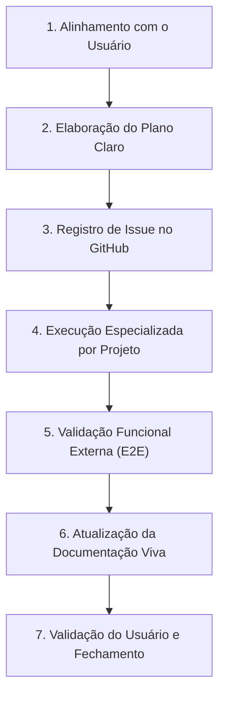

# Diretrizes e Modelo Operacional de Trabalho com Agentes Autônomos

## 1. Visão Geral e Filosofia do Projeto

A plataforma **Flag Football** não é uma refatoração pontual de um sistema legado produtivo; trata-se de um **projeto novo em andamento**, cuja arquitetura, regras de negócio e integrações estão sendo refinadas e consolidadas **passo a passo**.

Atualmente, o foco prioritário do ecossistema é a **Fase de Gerenciamento**, composta principalmente por:
- **`flag_admin_web`**: Interface web administrativa de gestão de entidades e competições.
- **`flag_backend`**: API REST, serviços de negócio e persistência transacional (Spring Boot).
- **`flag_tester_e2e`**: Suíte de testes automatizados ponta a ponta (Playwright / TypeScript), validando a plataforma externamente como usuário real.
- **`flag-platform-docs`**: Repositório de documentação viva, especificações e ADRs.

*(Nota: Os aplicativos clientes `flag_public_app` e `flag_referee_app` serão integrados e refinados nas fases subsequentes).*

---

## 2. O Ciclo de Execução em 7 Etapas

O modo de trabalho é estritamente estruturado para garantir previsibilidade, governança e rastreabilidade:

### Etapa 1: Alinhamento Prévio com o Usuário
- Toda funcionalidade ou ajuste de domínio é discutido e alinhado com o usuário antes de qualquer código ser alterado.
- Definem-se objetivos de negócio, fronteiras e restrições.

### Etapa 2: Plano Claro de Execução
- O agente especialista / orquestrador decompõe o pedido em tarefas objetivas e passos técnicos verificáveis.
- Define o impacto em cada projeto e os critérios de aceitação.

### Etapa 3: Registro Formal de Issue no GitHub
- O orquestrador cria a(s) issue(s) formal(is) no repositório correspondente via GitHub CLI (`gh issue create`):
  - `cesargranelli/flag_admin_web`
  - `cesargranelli/flag_backend`
  - `cesargranelli/flag_tester_e2e`
  - ou qualquer outro repositório envolvido na demanda.
- A issue registra a motivação, escopo detalhado e checklist de critérios de aceite.

### Etapa 4: Execução Especializada por Projeto
- A implementação não se restringe apenas ao backend ou admin web; estende-se a **qualquer projeto da plataforma** conforme a necessidade da demanda.
- Agentes especialistas implementam as alterações no repositório pertinente seguindo os padrões arquiteturais vigentes (ex.: ADR-001 no frontend Flutter).

### Etapa 5: Validação Funcional Externa via E2E
- A validação das regras de negócio é delegada centralmente ao **`flag_tester_e2e`**.
- Os testes são executados externamente simulando a jornada de um usuário real, evitando a proliferação de testes unitários isolados que não garantem a interoperabilidade dos sistemas.

### Etapa 6: Atualização da Documentação Viva
- À medida que as regras e arquitetura evoluem, a documentação em `flag-platform-docs` (ADRs, especificações de componentes e regras de produto) deve ser **reescrita e atualizada ativamente**.

### Etapa 7: Validação e Fechamento
- Com a aprovação da validação E2E e confirmação do usuário, a issue é vinculada ao commit/PR e fechada, liberando o próximo ciclo de trabalho.

---

## 3. Modelo de Versionamento: GitFlow Obrigatório

Para garantir que **nada seja quebrado nas branches principais (`main` e `develop`)**, todo o desenvolvimento em qualquer repositório da plataforma deve seguir rigorosamente o padrão **GitFlow**:

1. **`main`**:
   - Código estável de produção. Nenhum commit direto é permitido.
2. **`develop`**:
   - Linha base de integração do desenvolvimento. Nenhum commit direto é permitido.
3. **`feature/<issue-ou-nome>`**:
   - Toda nova funcionalidade, refatoração ou ajuste de domínio deve ser desenvolvida em uma branch `feature/` criada **a partir de `develop`** (ex.: `feature/issue-12-institutions-backend`).
4. **`bugfix/<nome>`**:
   - Correções de bugs identificados durante o ciclo de desenvolvimento, criadas a partir de `develop`.
5. **`hotfix/<nome>`**:
   - Correções emergenciais criadas a partir de `main` e integradas de volta em `main` e `develop`.
6. **Integração e Fechamento**:
   - Apenas após a compilação local com sucesso e validação de testes (incluindo E2E no `flag_tester_e2e`), a branch é integrada via Pull Request / merge controlado na `develop`.

---

## 4. Diretrizes para Agentes Autônomos

1. **Sem Ações Apressadas**: Nenhum agente deve iniciar mutações de código em lote sem o alinhamento de escopo e a criação prévia da respectiva issue.
2. **Respeito Incondicional ao GitFlow**: Sempre verificar a branch atual (`git status`, `git branch`) e criar a respectiva branch `feature/` a partir de `develop` antes de implementar qualquer alteração de código. Jamais alterar diretamente `develop` ou `main`.
3. **Separação de Responsabilidades**: Respeitar estritamente os domínios da plataforma (ex.: Organizações são exclusivamente Federações, Associações e Ligas; Agremiações são Clubes e Universidades).
4. **Padrão de Código Limpo**: Remoção obrigatória de código legado ou shims obsoletos quando uma nova estrutura é consolidada.
