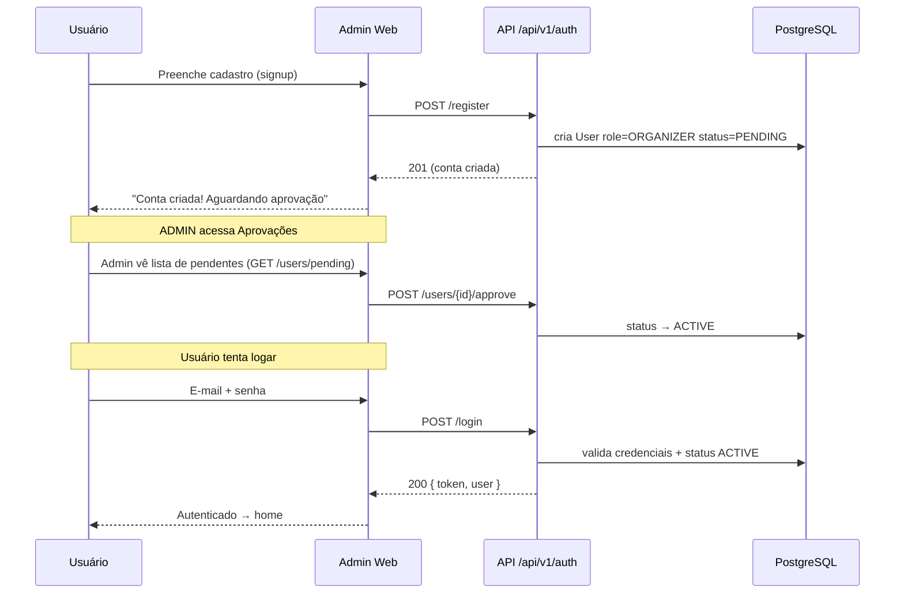
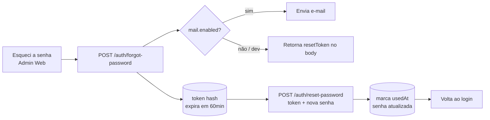
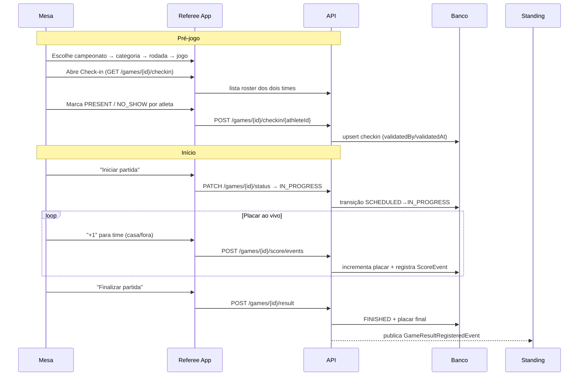
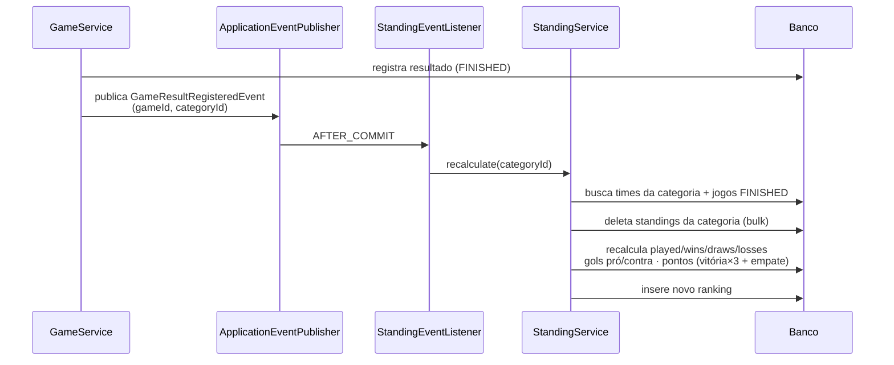
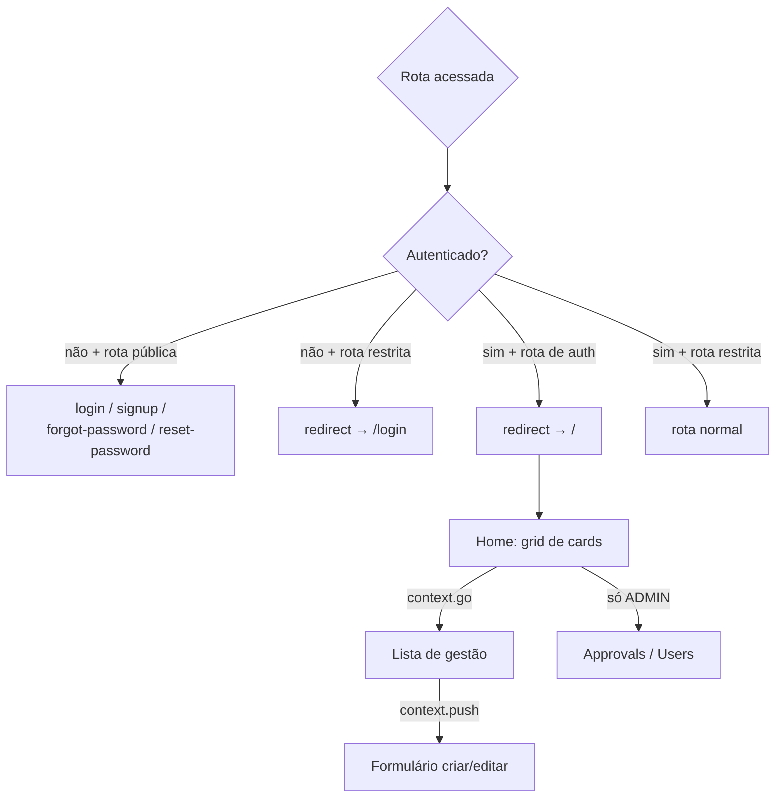

# Flag Platform — Fluxos Lógicos da Solução

Fluxos ponta a ponta do sistema, do cadastro de uma conta até a operação ao vivo de uma partida. Diagramas em Mermaid (renderizam no GitHub).

---

## 1. Ciclo de vida de uma conta (registro → aprovação → login)



**Pontos-chave**
- Registro público cria sempre um **ORGANIZER com status `PENDING`**.
- Conta `PENDING`/`REJECTED` ao logar → **403 `AccountPendingApprovalException`**.
- Somente **ADMIN** aprova/rejeita (`POST /users/{id}/approve` | `/reject`).
- ADMIN também cria usuários direto (role livre, status já `ACTIVE`) — ex.: contas da **mesa** (`MESA`).
- Login tem **rate limit** por IP (`LoginRateLimitFilter`): 10 tentativas / 300s → **429**.

### Recuperação de senha



---

## 2. Cadastro do campeonato (Admin Web)

```mermaid
flowchart TB
    A[Organizador logado<br/>home com cards] --> B[Organizações]
    B --> B1[Formulário wizard 3 etapas:<br/>Identificação · Contato · Visual]
    B1 --> B2[POST /organizations]

    B2 --> C[Campeonatos]
    C --> C1[Formulário<br/>organização + datas + status]
    C1 --> C2[POST /competitions]

    C2 --> D[Estrutura do campeonato]
    D --> D1[Categories → POST /categories]
    D --> D2[Venues → POST /venues]
    D --> D3[Teams → POST /teams]
    D --> D4[Rounds → POST /rounds]
    D --> D5[Games → POST /games]
    D5 --> D6[Athletes + Roster<br/>POST /athletes + POST /teams/{id}/roster]

    E[Public App<br/>consulta tudo sem login] --> C2
```

Hierarquia (FK em cadeia): `organization → competition → category → {venue, team, round} → game`.

---

## 3. Dia do jogo — operação ao vivo (Referee App)



### Validação de atleta durante a partida

```mermaid
flowchart TD
    A[Atleta chega no jogo em andamento] --> B[Mesa toca Validar]
    B --> C[POST /games/{id}/checkin/{athleteId}/validate]
    C --> D{Atleta está no roster<br/>do time do jogo?}
    D -->|não| E[Retorna NOT_REGISTERED]
    E --> E1[Referee App mostra<br/>'não está no roster']
    D -->|sim| F[Upsert PRESENT]
    F --> G[Libera atleta em campo]
```

**Regras de status de jogo** (transições válidas):

```
SCHEDULED ──► IN_PROGRESS ──► FINISHED   (terminais: FINISHED, CANCELLED)
     └──────► CANCELLED
```

- Registrar resultado, somar ponto e corrigir placar exigem jogo **IN_PROGRESS** (`GameNotInProgressException` → 409).
- Transição inválida → `InvalidGameStatusTransitionException` → 409.

---

## 4. Classificação automática (Standing)



**Ordenação da classificação**: pontos ↓ → saldo de gols ↓ → gols pró ↓ → nome do time ↑. A posição é atribuída sequencialmente no response.

---

## 5. Navegação e autenticação dos apps

### Admin Web (GoRouter com proteção)



- `refreshListenable: AuthController` — qualquer mudança de estado reavalia o redirect.
- Rotas explícitas no browser (`context.go`) mantêm o path; formulários usam `context.push` (pilha) com `BackButton`.
- A home exibe **cards** (mesmos ícones do antigo menu lateral), variando por role: **Aprovações** e **Usuários** só para `ADMIN`.

### Referee App (GoRouter protegido)

```
/login      (público, mesa)
/           home da mesa → push /operation | /checkin
/operation  operação ao vivo (iniciar, placar, finalizar)
/checkin    check-in e validação de atletas
```

### Public App (GoRouter público)

```
/                  home → lista de campeonatos
/competition/:id   detalhe (placeholder) → sub-rotas games | results | standings
/game/:id          detalhe do jogo (auto-refresh 10s do placar ao vivo)
```

---

## 6. Endpoints principais (API REST `/api/v1`)

| Área | Endpoints |
|------|-----------|
| **Auth** | `POST /auth/register`, `POST /auth/login`, `POST /auth/forgot-password`, `POST /auth/reset-password`, `GET /auth/me`, `GET|POST /auth/users`, `GET /auth/users/pending`, `POST /auth/users/{id}/approve\|reject` |
| **Organizações** | `POST /organizations`, `GET /organizations`, `GET/PUT /organizations/{id}` |
| **Campeonatos** | `POST /competitions`, `GET /competitions`, `GET /competitions/{id}`, `GET /organizations/{orgId}/competitions`, `PUT /competitions/{id}` |
| **Categorias** | `POST /categories`, `GET /competitions/{id}/categories`, `PUT/DELETE /categories/{id}` |
| **Campos** | `POST /venues`, `GET /venues`, `GET/PUT /venues/{id}` |
| **Times** | `POST /teams`, `GET /categories/{id}/teams`, `GET/PUT /teams/{id}` |
| **Rodadas** | `POST /rounds`, `GET /categories/{id}/rounds`, `PUT /rounds/{id}` |
| **Jogos** | `POST /games`, `GET /rounds/{id}/games`, `GET /competitions/{id}/games`, `GET/PUT /games/{id}`, `PATCH /games/{id}/status`, `POST /games/{id}/result`, `POST /games/{id}/score/events`, `PATCH /games/{id}/score`, `GET /games/{id}/score/events` |
| **Classificação** | `GET /categories/{id}/standings` |
| **Atletas** | `POST /athletes`, `GET /athletes`, `GET/PUT /athletes/{id}` |
| **Roster** | `POST /teams/{id}/roster`, `GET /teams/{id}/roster`, `DELETE /teams/{id}/roster/{athleteId}` |
| **Check-in** | `GET /games/{id}/checkin`, `POST /games/{id}/checkin/{athleteId}`, `POST /games/{id}/checkin/{athleteId}/validate`, `GET /games/{id}/validations` |

Documentação interativa: Swagger UI em `/swagger-ui.html` e OpenAPI em `/api-docs`.
