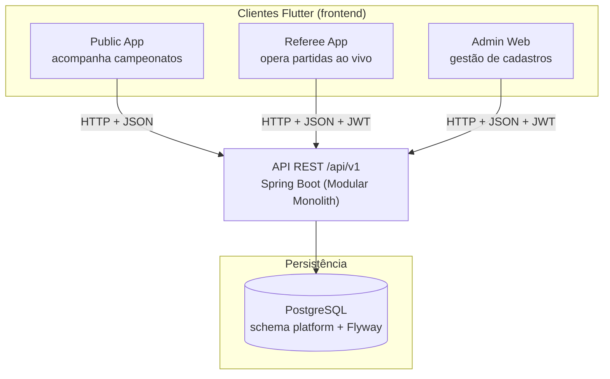
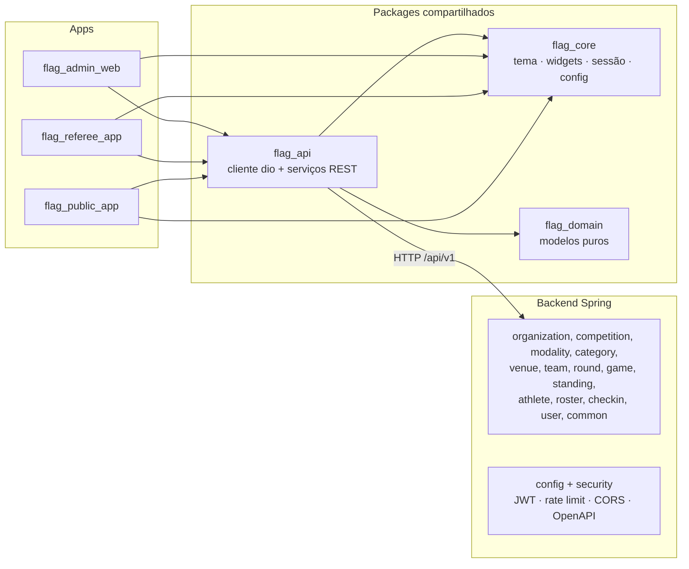

# Flag Platform — Visão Geral da Solução

> Documentação de arquitetura e fluxos da solução completa. Baseada no código-fonte (`backend`, `frontend`, `infrastructure`) e nos ADRs.

## O que é

A Flag Platform é uma **plataforma única de gestão e acompanhamento de campeonatos de Flag Football**. Uma única API REST (`/api/v1`) atende a **três clientes** distintos, cada um voltado a um papel:

| App | Plataforma | Usuário | Login | Recurso principal |
|-----|-----------|---------|-------|-------------------|
| **Public App** | Flutter mobile | Atletas / torcedores | Não | Acompanhar campeonatos: jogos, resultados, classificação, detalhes |
| **Referee App** | Flutter mobile | Mesa / delegado | Sim | Operar a partida ao vivo: iniciar/finalizar, placar, validar atletas |
| **Admin Web** | Flutter Web | Organizador | Sim | Gerenciar todos os cadastros do campeonato |

O domínio cobre um campeonato completo, de organizações até a validação de atletas em campo:

```
Organization
  └── Competition
        └── Category (modalidade + gênero + faixa etária)
              ├── Modality (catálogo: Flag 5x5, 8x8, 9x9, Full Pads 11x11)
              ├── Venue
              ├── Team
              │     └── TeamRoster ────── Athlete
              └── Round
                    └── Game
                          ├── Standing (calculado)
                          └── CheckIn (validação de atleta por jogo)
```

## Arquitetura em camadas



## Decisões de arquitetura (resumo)

| Decisão | Onde | Detalhe |
|---------|------|---------|
| **Monorepo** | ADR-002 | Backend, frontend, infra e docs no mesmo repositório |
| **Modular Monolith** | ADR-003 | Spring Boot com módulos isolados por domínio (`@ApplicationModule`); sem microsserviços/K8s/event broker |
| **API First** | ADR-004 | Ordem Domínio → Banco (Flyway) → Service → API → Flutter; REST `/api/v1`, JSON, Bearer JWT, Swagger em `/swagger-ui.html` |
| **Isolamento de módulos** | código | Cada módulo expõe interfaces `{Lookup}`; `ArchitectureTest` valida o isolamento e gera PlantUML |
| **ID único** | código | Todos os módulos de domínio usam UUID como PK |

## Componentes por camada



## Como a solução flui de ponta a ponta

1. **Organizador** cadastra organização e publica um campeonato (Admin Web) → cria categorias (combinação modalidade + gênero + faixa etária), campos, times, rodadas e agenda jogos.
2. O **público** acompanha tudo sem login (Public App): calendário, resultados, classificação e detalhes de jogo com placar ao vivo (atualização por polling a cada 10s).
3. No dia, a **mesa** (Referee App) faz o check-in dos atletas no pré-jogo, inicia a partida, atualiza o placar ponto a ponto e finaliza.
4. Ao finalizar, o backend **recalcula a classificação** automaticamente.
5. Contas novas passam por **aprovação de um ADMIN** antes de entrar; a mesa é criada por um ADMIN.

## Documentos desta seção

- [Visão geral (este arquivo)](overview.md)
- [Mapa de componentes](components.md)
- [Fluxos lógicos da solução](logical-flows.md)
- [Papéis, contexto e autorização](roles-and-permissions.md)
