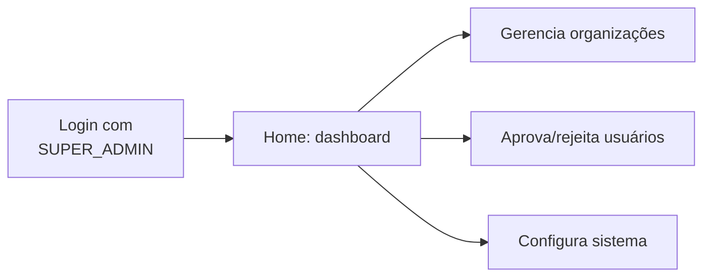
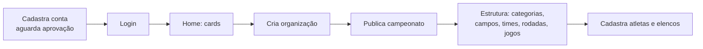
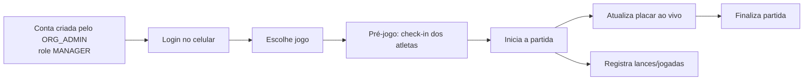
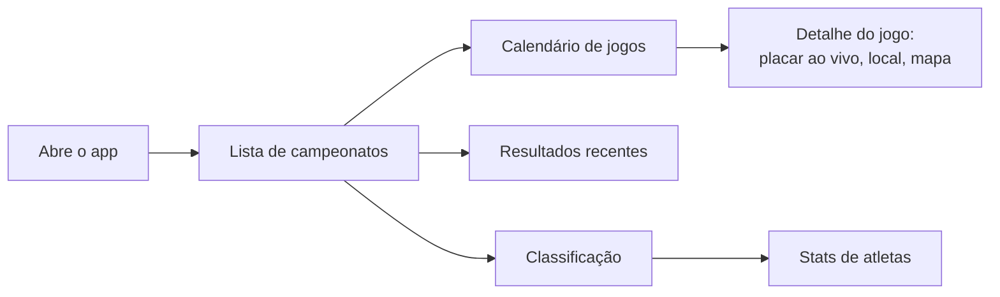

# Flag Platform — Papéis, Contexto e Autorização

Como cada ator usa a plataforma, quais papéis existem e o que cada um pode fazer na API.

## Estrutura da Plataforma

| App | Responsabilidade | Público-alvo |
|-----|-----------------|--------------|
| **Flag Backend** | API REST, regras de negócio, persistência | Todos os apps |
| **Flag Admin Web** | Gestão administrativa, cadastros | Staff, organizadores |
| **Flag Referee App** | Operação de jogos, check-in, lances | Árbitros, mesa |
| **Flag Public App** | Torcedores, atletas, público | Todos |
| **Flag Tester e2e** | Testes end-to-end | QA, Dev |

## Contexto de uso (por que a plataforma existe)

Comunidade de Flag Football no Brasil. As informações estão hoje espalhadas em PDF, Instagram, WhatsApp e planilhas; o app oficial tem baixa qualidade e o site é inoperante. A Flag Platform reúne tudo em um lugar: **calendário, resultados, classificação, elenco, mapa do campo e operação ao vivo**, com padrão único entre organizações.

## Hierarquia Organizacional

```
Organization (Federação/Liga)
    └── Club (Clube/Universidade)
         └── Team (Time de competição)
              └── Roster (Elenco por Season)
                   └── Athlete (Atleta)
```

## Papéis de sistema

### Hierarquia de Roles (4 níveis)

```
SUPER_ADMIN (1)
    └── ORG_ADMIN (N por organização)
         └── MANAGER (N por clube/time)
              └── USER (N - atleta/coach/referee)
```

### Backend — roles (enum `UserRole`)

| Role | Uso | Criação | App Principal |
|------|-----|--------|--------------|
| **SUPER_ADMIN** | Super usuário: aprova contas, gerencia usuários, cria organizações | Via seed/ADMIN | Admin Web |
| **ORG_ADMIN** | Gestão de conteúdo do campeonato específico | SUPER_ADMIN | Admin Web, Referee App |
| **MANAGER** | Operação de jogos, check-in, atualização de placar | ORG_ADMIN ou SUPER_ADMIN | Referee App |
| **USER** | Atleta, coach, referee - acesso básico | Auto-cadastro ou ADMIN | Public App |

### Skills (Custom Claims Firebase - futuro)

Além dos roles hierárquicos, usuários podem ter skills específicos:

| Skill | Descrição | Apps |
|-------|-----------|------|
| `athlete` | Praticante de flag football | Public App |
| `coach` | Treinador de equipe | Admin Web, Referee App |
| `referee` | Árbitro certificado | Referee App |
| `manager` | Gestor de clube/time | Admin Web, Referee App |

### Status de conta (enum `UserStatus`)

```
PENDING ─► ACTIVE
   │
   └──► REJECTED
```

- Registro público → **PENDING** até aprovação de um SUPER_ADMIN.
- Conta SUPER_ADMIN/ORG_ADMIN criada por SUPER_ADMIN → já **ACTIVE**.
- `login` exige `ACTIVE` (senão 403).

## Matriz de permissões (API)

Expressões centralizadas em `SecurityExpressions` (SpEL) e aplicadas via `@PreAuthorize`.

| Operação | SUPER_ADMIN | ORG_ADMIN | MANAGER | USER | Público |
|----------|:-----------:|:---------:|:-------:|:----:|:-------:|
| **CRUD de conteúdo** (organização, campeonato, categoria, campo, time, rodada, jogo, atleta, roster) | ✅ | ✅ | ❌ | ❌ | ❌ |
| **Leitura pública** (listas/detalhes de todos os domínios) | ✅ | ✅ | ✅ | ✅ | ✅ |
| **Operação ao vivo** (status do jogo, resultado, pontos, corrigir placar) | ✅ | ✅ | ✅ | ❌ | ❌ |
| **Check-in e validação de atletas** | ✅ | ✅ | ✅ | ❌ | ❌ |
| **Gestão de usuários** (criar, listar, aprovar, rejeitar) | ✅ | ❌ | ❌ | ❌ | ❌ |
| **Login / registro / recuperação de senha** | ✅ | ✅ | ✅ | ✅ | ✅ |
| **`GET /games/{id}/checkin`** (regra especial) | ✅ | ✅ | ✅ | ❌ | ❌ |

**Aplicação por tela:**

- Admin Web mostra **Aprovações** e **Usuários** apenas para `SUPER_ADMIN` (cards da home variam por role).
- Referee App opera jogos com role `ORG_ADMIN` ou `MANAGER`.
- Public App é público, mas usuários logados podem ver stats personalizados.

## Jornadas por papel

### Super Admin (Admin Web)



**Resultado esperado**: visão completa do sistema, controle total sobre organizações e usuários.

### Org Admin (Admin Web / Referee App)



**Resultado esperado**: manter o campeonato atualizado em poucos cliques, sem planilhas/PDF/WhatsApp.

### Manager (Referee App)



**Resultado esperado**: operar a partida em menos de 30 segundos — iniciar, placar, validar atletas, finalizar.

### Atleta / Torcedor (Public App — sem login)



**Resultado esperado**: saber tudo sobre o campeonato — próximo jogo, campo, adversário, placar e classificação.

## Segurança transversal

- **JWT HS256** (stateless) injetado por `JwtAuthenticationFilter`; expiração configurável (`app.jwt.expiration-seconds`, default 3600s).
- **Rate limit** no login: `LoginRateLimitFilter` (10 tentativas / 300s por IP → 429).
- **Token de reset de senha**: armazenado com hash SHA-256, expira em 60min, uso único (`usedAt`); anti-enumeração (não revela se o e-mail existe).
- **Senhas**: BCrypt.
- **Erros de API**: `ApiException` → RFC-7807 (`ProblemDetail`) com status HTTP coerente (400/401/403/404/409/429).
- **CORS**: liberado para `localhost:*` em dev (Flutter Web) + origens configuráveis.

## Modelo de domínio (visão geral)

| Entidade | Tabela | FK |
|----------|--------|-----|
| Organization | `organizations` | — |
| Club | `clubs` | organization_id |
| Competition | `competitions` | organization_id |
| Category | `categories` | competition_id |
| Venue | `venues` | organization_id |
| Team | `teams` | category_id |
| Round | `rounds` | category_id |
| Game | `games` | round_id, home_team_id, away_team_id, venue_id |
| ScoreEvent | `score_events` | game_id, team_id |
| Standing | `standings` | category_id, team_id |
| Athlete | `athletes` | — |
| RosterEntry | `team_roster` | team_id, athlete_id |
| CheckIn | `checkins` | game_id, team_id, athlete_id |
| User | `users` | — |
| PasswordResetToken | `password_reset_tokens` | user_id |
